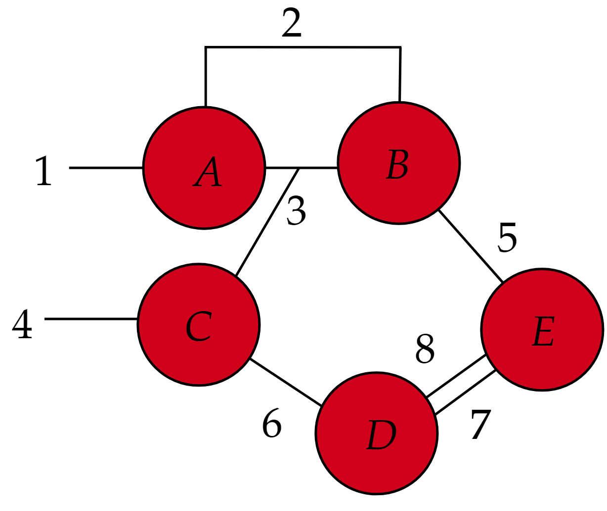

# ContraKit

This program ContraKit is a Docker-based program to optimize the contraction order for tensor network.

Originally this is a warpper of wonderful Julia package [OMEinsumContractionOrders](https://github.com/TensorBFS/OMEinsumContractionOrders.jl).  However, the Julia-based package is not perfectly accessible for all developer and researcher in the field of tensor network. 

Our target is to make the optimization **AS SIMPLE AS POSSIBLE**, and can be easily utilized for everyone.

## Hands-on

### Step 1: Build Docker Image

Later, when the image is stable, we will try to upload an Image to bypass this procedure. For now, to achieve this:

```bash
docker build -t contrakit -f .\Dockerfile .
# or for Makefile:
make build
```

### Step 2: Prepare an input file

See: **Basic Tutorial part**, you need to give a file.

### Step 3: Let Docker runthe program

```bash
docker run --mount type=bind,source=".",target=/app contrakit \
 ./examples/net.yaml ./tmp/res.yaml
# or 
make run
```
Here, `./examples/net.yaml` is the input file, and `./tmp/res.yaml` is a generated output file.

## Basic Tutorial

### Concept 1: Tensor Networks

To contract a tensor network, you may have a lot of tensors. In `ContraKit`, All of them will be regarded as number. Users are expected to provide `ContraKit` with all necessary information regarding the tensor network.

To delivery this information, `YAML` is a human-friendly interface to achieve this task. In the `YAML` file, all edges are labeled with number while you can use arbitary `string` to label tensors(vertices).

As an example, we can use the following `YAML` to represent the figure.



The corresponding `YAML` file is

```yaml
vertices:
    A: [1,2,3]   # `A` can be arbitary string, expect negative integer
    B: [3,2,5]   # The order is important for users, but not ContraKit
    C: [6,3,4]
    D: [6,7,8]
    E: [5,7,8]

output: [1,4]  # the legs of output

variables:
    chi : 5
    D   : 2

edges:
    1: 6     # Number is availble 
    2: chi   # Variable are OK
    3: D^2   # Julia math notation
    4: chi*D # This is also available
    5: chi*D
    6: chi*D
    7: chi*D
    8: D^2
```

### Concept 2: Contraction Order

We also use `YAML` file to input and output the contraction order. It is very simple to understand what to do.

For example,

```yaml
Step: 1
    Eins:
        Input: ((5, 7, 8), (6, 7, 8))
        Output: (5, 6)

    Tensors:
        Input: ("E", "D")
        Output: (-4,)


Step: 2
    Eins:
        Input: ((5, 6), (3, 2, 5))
        Output: (6, 3, 2)

    Tensors:
        Input: (-4, "B")
        Output: (-3,)


Step: 3
    Eins:
        Input: ((6, 3, 2), (6, 3, 4))
        Output: (2, 4, 3)

    Tensors:
        Input: (-3, "C")
        Output: (-2,)


Step: 4
    Eins:
        Input: ((1, 2, 3), (2, 4, 3))
        Output: (1, 4)

    Tensors:
        Input: ("A", -2)
        Output: (-1,)
```

The output of ContraKit will also take the similar forms.

### Concept 3: Algorithms

Currently, we are using `TreeSA(sc_target=29, βs=0.1:0.1:20,ntrials=5, niters=30, sc_weight=2.0)` in [OMEinsumContractionOrders](https://github.com/TensorBFS/OMEinsumContractionOrders.jl). A general user interface is under development.